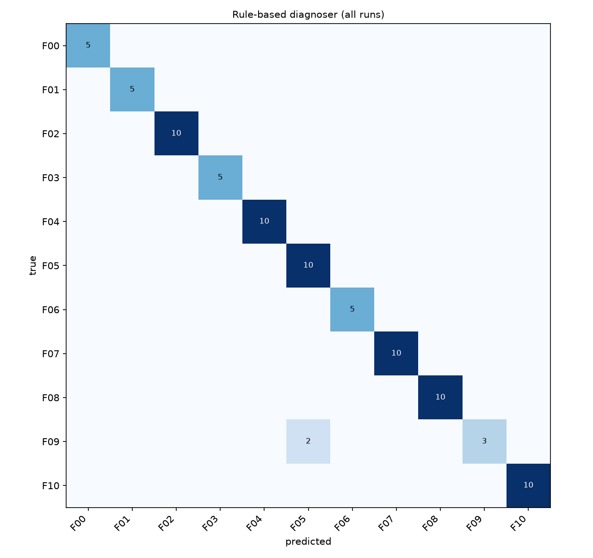
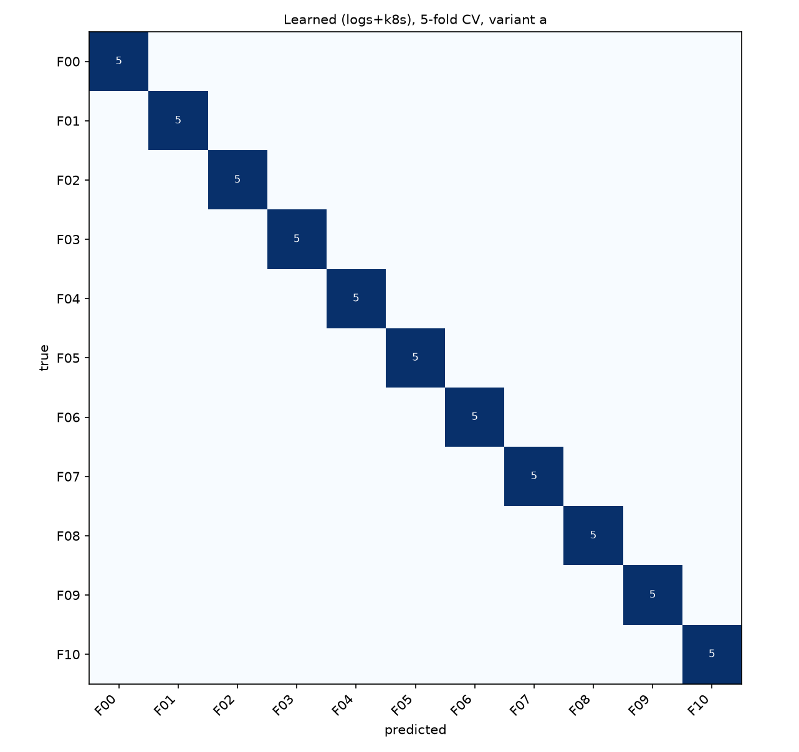

# k8s-misconfig-diagnosis

Diagnosing configuration-induced failures in a Kubernetes microservice app from logs and cluster state.

A small app runs on a local k3s cluster (k3d). I inject common misconfigurations one at a time, collect logs, events and object state, and compare two ways of finding the broken setting:

- **Rules**: match a runtime symptom (log pattern, event, pod status) and cross-check it against the live config to point at the exact field, e.g. `deployment/orders:containers[orders].env.REDIS_HOST`.
- **Learned model**: logistic regression on TF-IDF of normalised log/event templates plus pod state counts. It only sees runtime behaviour, not the config.

Most fault classes have two variants: "a" breaks a setting in one service, "b" breaks the same kind of setting in a different service or field. Training on "a" and testing on "b" shows whether the diagnosis generalises.

## App

```
loadgen -> frontend -> orders -> postgres
                          |
                          +----> redis (cache)
```

`frontend`, `orders` and `loadgen` share one Python image (`app/`) and log JSON to stdout. loadgen logs status and latency for every request, which is used as the user-facing symptom.

## Faults

| ID | Misconfiguration | Variant a | Variant b | Expected symptom |
|---|---|---|---|---|
| F00 | none (baseline) | - | - | - |
| F01 | Service targetPort != containerPort | orders Service | - | connection refused |
| F02 | wrong hostname in env var | orders REDIS_HOST | frontend ORDERS_URL | DNS resolution errors |
| F03 | wrong DB password in Secret | orders-db | - | auth failure, CrashLoopBackOff |
| F04 | memory limit too low | orders | frontend | OOMKilled |
| F05 | readiness probe wrong path | orders | frontend | pod never Ready |
| F06 | liveness probe wrong port | orders | - | repeated restarts |
| F07 | image tag does not exist | orders | frontend | ImagePullBackOff |
| F08 | Service selector != pod labels | orders Service | frontend Service | no endpoints |
| F09 | NetworkPolicy blocks DB | postgres | - | DB connection timeouts |
| F10 | CPU limit too low | orders | frontend | high latency, probe timeouts |

Commands and ground truth for each fault are in `faults/faults.yaml`. App Deployments use `strategy: Recreate` so a bad config replaces the healthy pod instead of being hidden behind it during a rolling update.

## Setup (WSL2, Ubuntu 24.04)

Docker, kubectl and k3d:

```bash
curl -fsSL https://get.docker.com | sudo sh
sudo usermod -aG docker $USER      # log out and back in afterwards
curl -LO https://dl.k8s.io/release/v1.31.0/bin/linux/amd64/kubectl
sudo install kubectl /usr/local/bin/kubectl && rm kubectl
curl -s https://raw.githubusercontent.com/k3d-io/k3d/main/install.sh | bash
```

Python environment:

```bash
sudo apt install -y python3-venv
python3 -m venv .venv
source .venv/bin/activate
pip install -e ".[dev]"
pytest -q
```

Cluster and baseline:

```bash
k3d cluster create confdiag --agents 1
docker build -t demo-app:v1 app/
k3d image import demo-app:v1 -c confdiag
kubectl apply -f k8s/base/
kubectl -n demo wait --for=condition=available deployment --all --timeout=240s
kubectl -n demo logs deploy/loadgen --tail=5
```

I used an 8 GB / 4 CPU WSL2 VM (`.wslconfig`).

## Usage

```bash
confdiag list                                        # faults and ground truth
confdiag collect --fault F02 --variant a --runs 1    # one run
confdiag diagnose data/raw/F02-a/<run-id>            # diagnose one run
confdiag collect --all --runs 5                      # full dataset
confdiag evaluate                                    # metrics and plots in results/
```

Each run resets the namespace, waits for the baseline, injects the fault, observes for 120 s and saves a snapshot to `data/raw/<fault>-<variant>/<run-id>/`. A run takes about 4 minutes. Fault order is shuffled in each round.

Development runs (used while writing rules and features) are kept separate from the runs used for evaluation:

```bash
confdiag collect --all --runs 2 --data-dir data/dev
confdiag collect --all --runs 5
```

Checking that the NetworkPolicy is enforced (F09):

```bash
kubectl apply -f faults/manifests/deny-postgres.yaml
kubectl -n demo exec deploy/frontend -- python -c "import socket; socket.create_connection(('postgres', 5432), timeout=3)"
kubectl -n demo delete networkpolicy deny-postgres
```

The second command should fail with a timeout.

## Evaluation

`confdiag evaluate` runs three experiments:

1. Rules on all runs: fault accuracy and localisation accuracy (exact config field).
2. Learned model, stratified k-fold on variant a, with three feature sets: logs only, Kubernetes state only, both.
3. Learned model and rules trained/checked on variant a, tested on variant b.

Outputs: `results/summary.md`, `results/metrics.json`, `results/per_run.csv`, confusion matrices and `results/top_features.json`.

## Results

Code: tag `v0.1-eval`. 85 runs (17 scenarios x 5), collected in 5 shuffled rounds on my laptop (WSL2, 8 GB). I wrote and tuned the rules and features on a separate set of 34 dev runs, which are not included here.

| Experiment | Method | n | Accuracy | Macro-F1 | Localisation |
|---|---|---|---|---|---|
| All runs | Rules | 85 | 0.976 (83/85) | 0.969 | 0.975 (78/80) |
| 5-fold CV, variant a | Logs only | 55 | 0.782 | 0.770 | - |
| 5-fold CV, variant a | K8s state only | 55 | 0.818 | 0.816 | - |
| 5-fold CV, variant a | Logs + K8s | 55 | 1.000 | 1.000 | - |
| Train a, test b | Logs only | 30 | 0.367 | 0.217 | - |
| Train a, test b | K8s state only | 30 | 0.833 | 0.714 | - |
| Train a, test b | Logs + K8s | 30 | 0.900 | 0.796 | - |
| Train a, test b | Rules | 30 | 1.000 | 1.000 | 1.000 |

Localisation means the exact config field was named (fault runs only).

Variant b, per fault (all b variants break frontend):

| Fault | Logs only | K8s only | Logs + K8s | Rules |
|---|---|---|---|---|
| F02 wrong hostname (ORDERS_URL) | 1/5 | 0/5 | 2/5 | 5/5 |
| F04 memory limit | 0/5 | 5/5 | 5/5 | 5/5 |
| F05 readiness probe path | 5/5 | 5/5 | 5/5 | 5/5 |
| F07 image tag | 0/5 | 5/5 | 5/5 | 5/5 |
| F08 Service selector | 5/5 | 5/5 | 5/5 | 5/5 |
| F10 CPU limit | 0/5 | 5/5 | 5/5 | 5/5 |




### Notes

On services seen in training, logs alone got 0.78 and pod state 0.82. Using both got every run right.

Logs did not transfer to a different service. When frontend itself is broken (OOMKilled, missing image, CPU-starved) it logs very little, so the only log signal is loadgen failing to connect. The logs-only model labelled all of these F08. Pod state (OOMKilled, ImagePullBackOff, probe failures) looks the same whichever service is broken, so that part transferred.

F02-b was the hardest case. The frontend pod stays healthy and users get 502s, which from the pod side looks exactly like F01 (wrong targetPort), so K8s-only predicted F01 in all 5 runs. The log text is different (DNS failure vs connection refused), but in training the DNS error only came from the orders Redis client, not from frontend's HTTP client. The rules got it right because they pull the hostname out of the error and check that no Service with that name exists.

The rules missed F09 in 2 of 5 runs. I assumed a NetworkPolicy would drop packets and orders would log DB timeouts. On k3s the policy mostly rejects the connection, so orders logs "Connection refused", the same as a stopped database. Timeout lines per F09 run: 3, 2, 0, 0, 3. The three correct runs only worked because of a few unrelated timeouts. In the other two, the rules reported the readiness probe failure (orders /ready returns 503 when the DB is unreachable) as the cause.

With a wrong REDIS_HOST (F02-a) users still got HTTP 200, since orders falls back to Postgres. Only the logs show that anything is wrong.

### Changes made on the dev runs

- Start Postgres and Redis before the apps. Otherwise orders crash-looped at startup and the healthy baseline had restarts.
- DNS rule: inside the cluster the error is "No address associated with hostname", not "Name or service not known".
- Only count Warning events. Normal rollout events (ScalingReplicaSet, SuccessfulCreate, ...) showed how a fault was injected, not what it was. Dev K8s-only CV went from 0.91 to 0.73 after removing them.
- Mask access-log timestamps. The month name had become a feature.

### Next (v0.2)

- NetworkPolicy rule that works for both drop and reject: the target Service has ready endpoints, clients still fail, and a NetworkPolicy selects the target pods.
- Faults with no pod-state signal (wrong DB_PORT, REDIS_HOST pointing at another existing Service, missing ConfigMap key), on fresh runs.

## Limitations

- One small app and one fault at a time.
- Faults are chosen by hand, so the distribution is not realistic.
- The rules read live config and the learned model does not, so they are not a like-for-like comparison.
- CPU-related faults are sensitive to load on the host.

## Next steps

- Faults not covered by any rule (wrong DB_PORT, env var pointing at a different existing service, missing ConfigMap key).
- Two simultaneous faults.
- Log template mining (e.g. Drain) instead of regex normalisation.
- Ranking candidate config fields (top-k localisation).

## Layout

```
app/                demo services and Dockerfile
k8s/base/           baseline manifests
faults/             fault catalogue and extra manifests
src/confdiag/       collector, parser, features, rules, model, evaluation
tests/              unit tests and an offline simulator
```
